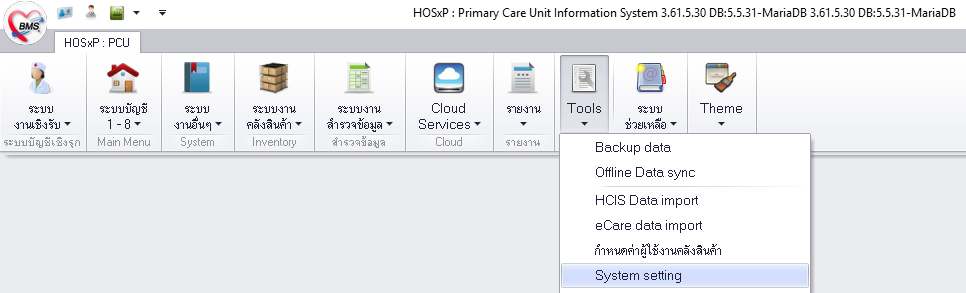
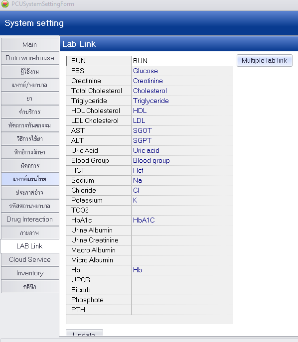
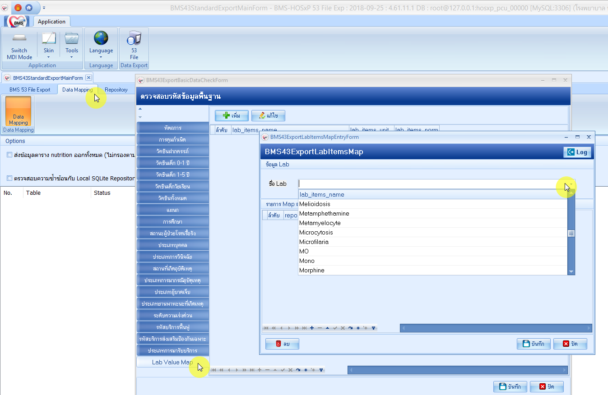

# การตั้งค่าเพื่อการส่งออกข้อมูล LABFU ในระบบฐานข้อมูล Hosxp ระดับ รพ.สต. ปีงบประมาณ 2562

Editor	: 	inforeportable
Update	:	2018-12-14 15:55
Email	: 	inforeportable@gmail.com

------

เหมาะ สำหรับผู้ใช้งาน 

- [ ] ผู้ใช้งานระดับเริ่มต้น

- [x] ผู้ใช้งานระดับกลาง (มีการจับคู่รายการแลป , ใช้โปรแกมที่เกี่ยวข้อง มากกว่า 1 โปรแกรม)
- [x] ผู้ใช้งานระดับสูง (มีการใช้คำสั่ง SQL , ตรวจสอบ ความถูกต้องของข้อมูล)

<div style="page-break-after: always;"></div>

# ที่มาของปัญหา

​	โครงสร้างมาตรฐานข้อมูลด้านการแพทย์และสุขภาพ กระทรวงสาธารณสุข หรือ โครงสร้างมาตรฐานข้อมูล 43 แฟ้ม ตั้งแต่ปีงบประมาณ 2560 เป็นต้นมา  มีการปรับเปลี่ยนที่สำคัญคือ มีการเพิ่มรหัสมาตรฐาน ในแฟ้ม  LABFU เพื่อให้รองกับจำนวน ผลตรวจทางห้องปฏิบัติการให้มากขึ้น จากเดิม ที่มีอยู่ 21 รายการ และเกี่ยวข้องกับแฟ้ม CHRONIC หรือ แฟ้มทะเบียนผู้ป่วยโรคเรื้งรังเท่านั้น ให้เพิ่มมากขึ้น เพื่อให้รองรับกับการรายงานผล ร่วมกับ กิจกรรมด้านอื่นๆด้วย เช่น ผลตรวจ VDRL ในกลุ่มหญิงตั้งครรภ์ หรือ ผลตรวจการตรวจหาค่าฮีมาโตคริตในเลือด  ในกลุ่มเด็กเล็ก หรือ เด็กวัยเรียนเพื่อหาความเสี่ยงต่อภาวะซีดเป็นต้น

​	โดย ปัจจุบันนี้ ใช้ [โครงสร้างมาตรฐานข้อมูล 43 แฟ้ม version 2.3   ปีงบประมาณ 2561 ณ วันที่ 6 ธันวาคม 2560](http://bps.moph.go.th/new_bps/43file_version2.3) มีรหัสรายการ ทั้งหมด 1,433 รายการ และรหัสที่ใช้เป็นรหัส 7 หลัก จากเดิมที่ใช้เพียง 2 หลัก  เพื่อรองรับกับรายการที่มากขึ้นด้วย

​	แต่ปัญหาที่เกิดขึ้นก็คือ โปรแกรมที่ใช้สำหรับการบันทึกข้อมูลเพื่อให้ส่งออกข้อมูลนั้น มีการปรับโครงสร้างระบบฐานข้อมูลแล้ว แต่ หน่วยบริการ ยังไม่ทราบว่าเงื่อนไข อะไรทีทำให้ผลการบันทึกข้อมูล ถูกส่งออกได้อย่างถูกต้อง ครบถ้วน ตามรูปแบบมาตรฐาน หรือ โปรแกรมที่ใช้จะเป็นรุ่นใด การจับคู่รายการ LAB หรือ ระบุ รหัส 7 หลัก ผ่านโปรแกรมใด จึงได้จัดทำคำอธิบาย ขั้นตอน และตัวอย่างนี้ ไว้เพื่อหน่วยบริการ  สามารถเข้าไปจัดการตั้งค่า และ บันทึกผลได้เบื้องต้น

​	โดยได้ทำการติดต่อทาง Email ไปยัง BMS ผู้พัฒนาโปรแกรม และ ระบบฐานข้อมูลที่หน่วยบริการ เพื่อขอรับคำแนะนำแนวทางแก้ไขเบื้องต้น ซึ่งได้รับคำแนะนำมาดังนี้


> แนะนำให้ทำการ map รหัสมาตรฐาน 7 หลัก ที่ตาราง lab_items ฟิลด์ provis_labcode ให้ได้ 21 รายการขึ้นไป
> เมื่อใช้งานโปรแกรมส่งออก 43 แฟ้ม จะไม่แจ้งเตือนเรื่องการ map รหัส lab อีก 
> และโปรแกรมจะทำการดึงผล LAB ทุกตัวจากตาราง lab_order มาส่งออกแทนตาราง opdscreen


​	จากคำแนะนำดังกล่าวจึงได้ทดลอง ทำตามวิธีและมีผลลัพพธ์ได้ถูกต้อง  จึงสรุปได้ดังนี้


**หากทำการ ใส่รหัส 7 หลัก มากกว่า หรือ เท่ากับ 21 รายการขึ้นไป**

- ผลแลป จะไปดึงมาจาก `lab_order.lab_order_result` เป็น `LABFU.LABRESULT`
- รหัส 7 หลัก จะไปดึงมาจาก `lab_items.provis_labcode` เป็น `LABFU.LABTEST`

**หากทำการ ใส่รหัส 7 หลัก น้อยกว่า 21 รายการขึ้นไป**

- จะมีหน้าต่างเตือน ตอนที่จะประมวลผล ส่งออก  43 แฟ้ม
- ผลแลป และ รหัส จะไปดึงผลมาจากตาราง `opdscreen` ทีมีการ + จับคู่รายการแลป และ มีการ + Update ผล Lab เรียบร้อย แล้วเท่านั้น

​	เมื่อพิจารณาจากข้อสรุปแล้ว หากต้องการแก้ไขที่ง่ายที่สุด  ก็แค่เพียงระบุ รหัส 7 หลัก ให้มากกว่า  21 รายการขึ้นไป ผลแลป และ รหัสแลป ก็จะถูกส่งออกได้อย่างถูกต้อง โดยที่ไม่จำเป็นต้อง ทำการจับคู่รายการแลปที่เหลือ  และทำการ Update Lab อื่นๆ

​	**แต่** วิธีการข้างต้นนั้น อาจจะทำให้ ผลแลปบางตัว ไม่ถูกส่งออกเช่น ผล DTX ก่อนอาหาร หรือ หลังอาหาร ที่หน้าฟอร์ม One Stop Service จะแปลผล  เมื่อผู้ป่วย ได้ขึ้นทะเบียนคลินิกพิเศษ เบาหวาน/ความดัน + ได้เข้ามารับบริการ + กดปุ่ม ว่ามารับบริการในคลินิก + ลงผล Dtx. ก่อน/หลัง

| รหัส 2 หลัก | รหัส 7 หลัก | รายละเอียด                                       |
| --------- | --------- | ----------------------------------------------- |
| 03        | `0531101` | 03=ตรวจน้ำตาลในเลือด   จากเส้นเลือดฝอย หลังอดอาหาร   |
| 04        | `0531102` | 04=ตรวจน้ำตาลในเลือด   จากเส้นเลือดฝอย โดยไม่อดอาหาร |

```
ตัวอย่าง ฟอร์ม One Stop Service ที่มีการบันทึก  dtx 
```


หรือ ผลแลปที่เกี่ยวข้องกับ ฟอร์มคลินิกพิเศษโรคเรื้อรัง เพื่อดูกราฟ การเปลี่ยนแปลง อาจะไม่สามารถดูการเปลี่ยนแปลงได้หากไม่มีการจับคู่รายการ Lab เช่น

| รหัส 2 หลัก | รหัส 7 หลัก | รายละเอียด                                                    |
| --------- | --------- | ------------------------------------------------------------ |
| 01        | `0531002` | 01=ตรวจน้ำตาลในเลือด   จากหลอดเลือดดำ หลังอดอาหาร                |
| 02        | `0531004` | 02=ตรวจน้ำตาลในเลือด   จากหลอดเลือดดำ โดยไม่อดอาหาร              |
| 05        | `0531601` | 05=ตรวจ   HbA1C                                              |
| 06        | `0546602` | 06=ตรวจ   Triglyceride                                       |
| 07        | `0541602` | 07=ตรวจ   Total Cholesterol                                  |
| 08        | `0541202` | 08=ตรวจ   HDL Cholesterol                                    |
| 09        | `0541402` | 09=ตรวจ   LDL Cholesterol                                    |
| 10        | `0583001` | 10=ตรวจ   BUN ในเลือด                                         |
| 11        | `0581902` | 11=ตรวจ   Creatinine ในเลือด                                  |
| 12        | `0440204` | 12=ตรวจโปรตีน   microalbumin ในปัสสาวะ (ใน filed ผลการตรวจใส่ค่า 0=negative, 1=trace,   2=positive) |

```
ตัวอย่างหน้าต่าง ดูการเปลี่ยนแปลงผลแลป ทะเบียนคลินิกพิเศษ เบาหวาน/ความดัน  -- รายการผู้ป่วย -- Graph
```


เพราะระบบจะดึงผลมาใส่จากชื่อที่มีการจับคู่เท่านั้น ไม่ได้ดึงมาจาก รหัสมาตรฐาน 7 หลัก ที่ระบุเข้าไป หรือ แม้กระทั้ง การคำนวนค่า egfr นั้นที่ระบบทำการคำนวนอัตโนมัติ และ ส่งออกมาให้ ก็ได้มาจากปัจจัย `ค่า Creatinine + เพศ + อายุ`

 เพศ	`หญิง`	ระดับ Creatinine ในเลือด (mg/dL)	`≤ 0.7`
$$ {`}
eGFR = 144\times((\frac{SCr}{0.7})^{-0.329})\times((0.993)^{Age})
$$ {`}
เพศ	`หญิง`	ระดับ Creatinine ในเลือด (mg/dL)	`> 0.7`
$$
eGFR = 144\times((\frac{SCr}{0.7})^{-1.209})\times((0.993)^{Age})
$$
 เพศ	`ชาย`	ระดับ Creatinine ในเลือด (mg/dL)	`≤ 0.9`
$$
eGFR = 141\times((\frac{SCr}{0.9})^{-0.411})\times((0.993)^{Age})
$$
 เพศ	`ชาย`	ระดับ Creatinine ในเลือด (mg/dL)	`> 0.9`
$$
eGFR = 141\times((\frac{SCr}{0.9})^{-1.209})\times((0.993)^{Age})
$$


กำหนด ให้ `Age` คือ อายุ หน่วย เป็น ปี

กำหนด ให้ `SCr` คือ ค่า Creatinine

ซึ่งค่า eGFR ระบบ จะไม่แสดงผล แต่ มีการส่งออกเมื่อการประมวล 43 แฟ้ม เป็นรหัส 7 หลัก ดังนี้

| รหัส 2 หลัก | รหัส 7 หลัก | รายละเอียด                                   |
| --------- | --------- | ------------------------------------------- |
| 15        | `0581904` | 03=การตรวจหาค่า eGFR (ใช้สูตร CKD-EPI formula) |

โดยที่กล่าวมาข้างต้นทั้งหมด อาจจะพบเจอปัญหาได้ หาก ไม่มีการ จับคู่ รายการ LAB 

------


# สรุปวิธีการแก้ปัญหา

> ​	**เพราะฉะนั้น เพื่อความสมบรูณ์ของข้อมูล และ การใช้งาน จึงจำเป็น ต้องมีการระบุ รหัส 7 หลัก ให้มากกว่า 21 รายการ ร่วมกับ จับคู่รายการ Lab และ ทำการ Update Lab ก่อนการประมวผลส่งออกข้อมูล**
>
> ​	**การจับคู่รายการ Lab ทำเพียงครั้งเดียว เหมือนการตั้งค่าใช้งานทั่วไป ไม่จำเป็นต้องทำหลายครั้ง แต่การ Update Lab ควรทำก่อนการประมวลผลทุกครั้ง เพื่อความครบถ้วน ถูกต้อง และ สมบูรณ์**


# ขั้นตอนการแก้ไข

1. ติดตั้งโปรแกรมที่เกี่ยวข้องให้ครบถ้วน

     1.1BMSHOSxPXE4CloudApplicationInstaller.exe

     1.2HOSxPXE PCU(สีฟ้า)

     1.3BMSHOSxPStandard43Export(สีขาว)

2. เปิดระบบ emergency mode และ ห้องตรวจ ผ่านเมนู SQL ด้วยโปรแกรม HOSxP PCU(สีเขียว)

 3. ปรับปรุงโครงสร้างฐานข้อมูล ด้วยโปรแกรม BMSHOSxPStandard43Export(สีขาว)

4. จับคู่รายการ LAB ในระบบ และ การ Update ผล LAB  ด้วยโปรแกรม HOSxP PCU(สีเขียว)

5. ระบุ รหัสมาตรฐาน  7 หลักในระบบ ด้วยโปรแกรม HOSxPXE PCU(สีฟ้า)

6. ประมวลผล และ ส่งออกข้อมูล ด้วยโปรแกรม BMSHOSxPStandard43Export(สีขาว)

<div style="page-break-after: always;"></div>

## 1.ติดตั้งโปรแกรมที่เกี่ยวข้องให้ครบถ้วน

### 1.1 BMSHOSxPXE4CloudApplicationInstaller.exe 

สัญลักษณ์	: 

รุ่น			: 4.61.12.9 ขึ้นไป

ดาวโหลด	: [BMSHOSxPXE4CloudApplicationInstaller](https://my.pcloud.com/publink/show?code=XZMQU17ZvmXi5nm0818TncMWdE5ob43agAX7)

เนื้อหา		: สำหรับ Download โปรแกรม และทำการติดตั้ง อีก 2 โปรแกรมเพิ่มเติมคือ HOSxPXE PCU และ BMSHOSxPStandard43Export ผ่าน ระบบ Internet จาก บริษัทของ BMS

การติดตั้ง	: ทำการดับเบิลคลิก เพื่อเปิดโปรแกรม สามารถเปิด ผ่าน USB ได้ ไม่จำเป็น ต้องติดตั้ง ลงในเครื่องคอมพิวเตอร์

```
1.1.1 ทำการดับเบิลคลิกเพื่อเปิดโปรแกรมได้ทันที
```


```
1.1.2 หากมีข้อความเตือน ดังรูปภาพตัวอย่าง เกิดจากโปรแกรม ได้ตรวจสอบ ผ่านระบบ Internet  พบว่า มีรุ่นที่ใหม่กว่า สามารถกด ปุ่ม "Yes" ได้ เพื่อทำการปรับปรุงโปรแกรม ที่ทำการติดตั้งได้ หลังจากนั้น ก็จะเริ่มทำการติดตั้ง โปแกรม อื่นๆ เพิ่มเติม คือ HOSxPXE PCU(สีฟ้า) และ BMSHOSxPStandard43Export(สีขาว) ตามลำดับ
```


------

### 1.2 HOSxPXE PCU(สีฟ้า) 

สัญลักษณ์	: 

รุ่น			: Build 73 ขึ้นไป

ดาวโหลด	: ผ่านโปรแกรม BMSHOSxPXE4CloudApplicationInstaller เท่านั้น

เนื้อหา		: สำหรับการจับคู่ รายการ LAB และ รหัส 7 หลักตามรายการมาตรฐาน 43 แฟ้ม 2.3 ปี 2561

การติดตั้ง	: 

```
1.2.1 ทำการดับเบิลคลิก ที่โปรแกรม BMSHOSxPXE4CloudApplicationInstaller.exe
```


```
1.2.2 ทำการเลือก HOSxPXE_PCU.exe จากนั้น กดปุ่ม Install
```


```
1.2.3 เมื่อทำการติดตั้งเสร็จ จะมีข้อความขึ้นดังรูปภาพด้านล่าง
```


```
1.2.4 จะมี Icon เพิ่มอยู่ที่หน้าจอ (สีฟ้า)
```


------

### 1.3 BMSHOSxPStandard43Export(สีขาว) 

สัญลักษณ์	: 

รุ่น			: Build 26 ขึ้นไป

ดาวโหลด	: ผ่านโปรแกรม BMSHOSxPXE4CloudApplicationInstaller เท่านั้น

เนื้อหา		: สำหรับการปรับปรุงโครงสร้างฐานข้อมูลของ hosxp และ การส่งออกข้อมูล 43 แฟ้ม

การติดตั้ง	: 

```
1.3.1 ทำการดับเบิลคลิก ที่โปรแกรม BMSHOSxPXE4CloudApplicationInstaller.exe
```


```
1.3.2 ทำการเลือก BMSHOSxPStandard43Export จากนั้น กดปุ่ม Install
```


```
1.3.3 เมื่อทำการติดตั้งเสร็จ จะมีข้อความขึ้นดังรูปภาพด้านล่าง
```


```
1.3.4 จะมี Icon เพิ่มอยู่ที่หน้าจอ (สีขาว)
```


<div style="page-break-after: always;"></div>

## 2. เปิดระบบ emergency mode และ ห้องตรวจ ผ่านเมนู SQL ด้วยโปรแกรม HOSxP PCU(สีเขียว) 

```
2.1 เปิดโปรแกรม HOSxp PCU(สีเขียว) ที่ใช้งานประจำ
```


```
2.2 เข้าไปที่เมนู Tools -- SQL QUERY
```


```
2.3 นำ SQL คำสั่งไปวางดังนี้ และ กด ปุ่ม Exec
UPDATE opdconfig SET opdconfig.emergency_mode = 'Y'
จะมี หน้าต่างแสดงขึ้นมา กดปุ่ม Yes
```


```
2.4 ระบบจะแสดงข้อความอีกครั้ง "Execute done." กดปุ่ม "OK" เสร็จสิ้นกระบวนการ
```


```
หมายเหตุ
	การ เปิด emergency mode นั้นก็เพื่อให้สามารถใช้การ Upgrade Structure ผ่านโปรแกรม BMSHOSxPStandard43Export(สีขาว) ได้ 
	ซึ่งหากหน่วยบริการ ผ่านการอบรม การส่งออกข้อมูลประกันสังคม ของจังหวัดนครปฐม แล้ว ก็จะสามารถ เข้าใช้งานได้ BMSHOSxPStandard43Export(สีขาว) และ HOSxPXE PCU(สีฟ้า) ได้ตามปกติ ไม่จำเป็นต้องใช้ คำสั่ง SQL เพราะ มีการ เพิ่มระบบรายงาน  ที่แทรกคำสั่ง SQL ไว้ในระบบแล้ว
```

คำสั่ง SQL เพิ่มเติม

เปิด emergency mode

```mysql
UPDATE opdconfig SET opdconfig.emergency_mode = 'Y'
```

เพิ่ม ห้องตรวจใน ระบบ HOSxP PCU เดิม ให้สามารถใช้งานได้ สาขาห้องตรวจ  HOSXP XE

```mysql
UPDATE kskdepartment 
SET kskdepartment.hospital_department_id = ( SELECT min(hospital_department.id) FROM hospital_department),
kskdepartment.depcode_active = 'Y',
kskdepartment.department_active = 'Y'
```

เปลียนชื่อ สาขาห้องตรวจเป็นชื่อ หน่วยบริการ 

```mysql
UPDATE hospital_department
SET hospital_department.NAME = ( SELECT opdconfig.hospitalname FROM opdconfig)
WHERE hospital_department.id = ( SELECT min(kskdepartment.hospital_department_id) FROM kskdepartment)
```
<div style="page-break-after: always;"></div>

## 3. ปรับปรุงโครงสร้างฐานข้อมูล ด้วยโปรแกรม BMSHOSxPStandard43Export(สีขาว) 
> คำเตือน 
>
> ขั้นตอนการปรับปรุงโครงสร้างฐานข้อมูลมีความเสี่ยงต่อการเกิดข้อมูลสูญหาย หรือ ระบบฐานข้อมูลอาจจะไม่สามารถใช้งานได้ตามปกติ ก่อนทำการปรับปรุงระบบโครงสร้างฐานข้อมูลทุกครั้ง ต้องปฏิบัติตามตามหัวข้อดังนี้
>
> 1. ทำการสำรองข้อมูลที่สมบูรณ์ เป็นปัจจุบันที่สุดไว้แล้ว อย่างน้อย 2 แห่งขึ้นไป เพื่อลดความเสี่ยงต่อการเกิดข้อมูลสูญหาย
> 2. ระหว่างทำการปรับปรุงข้อมูล ควรเลือกช่วงเวลาที่ไม่มีการใช้งานของระบบ หรือ งดการใช้เครื่องคอมพิวเตอร์ ที่มีการเชื่อมต่อ หรือ มีการใช้งานระบบฐานข้อมูลไว้ก่อนชั่วคราว เพราะหากมีการใช้งาน อาจจะทำให้ระบบเกิดความล้าช้า ล้มเหลว หรือ ไม่สามารถใช้งานได้ในเวลาที่ระบบมีการปรับปรุงระบบ
> 3. การเลือกคอมพิวเตอร์ ที่มีความเสถียรที่สุดในการปรับปรุงระบบ

```
3.1 ดับเบิลคลิกเปิดโปรแกรม BMSHOSxPStandard43Export(สีขาว)
```


```
3.2 เลือกที่ 
- กดที่ การเชื่อมต่อ
- กดที่ ทดสอบการเชื่อมต่อ
- รอซักครู่จะมี หน้าต่าแสดง ผล กดปุ่ม "OK" หลัจากนั้นรอซักครู่จะมีเมนูเพิ่มเติมแสดงขึ้นมา อาจะใช้เวลานานขึ้นอยู่กับ คุณสมบัติของเครื่องที่ใช้งาน และ ระบบฐานข้อมูล
```


```
3.3 ระบบจะแสดงเมนูเพิ่มเติมขึ้นมากดที่ Upgrade Structure
```


```
3.4 ระบบจะทำการตรวจสอบ ตารางต่างๆ และ ปรับปรุง โครงสร้าง เพิ่มช่องข้อมูล เพิ่มดัชนี
```


```
3.5 เมื่อเสร็จสิ้น ระบบจะขึ้นหน้าต่างดังรูปภาพตัวอย่าง "Upgrade Structure done." กดปุ่ม "OK" หลังจากนั้น ก็สามารถปิดโปรแกรมได้ เป็นการเสร็จสั้นขั้นตอนการปรับปรุงโครงสร้างฐานข้อมูล
```


> หมายเหตุ
>
> หากไม่สามารถกดปุ่ม "Upgrade Structure" ได้ และขึ้นข้อความ "Emergency Mode Only" ดังรูปภาพตัวอย่าง ต้องย้อนกลับไปปฏิบัติขั้นตอนที่  "2. เปิดระบบ emergency mode และ ห้องตรวจ ผ่านเมนู SQL ด้วยโปรแกรม HOSxP PCU(สีเขียว)" ก่อนให้เรียบร้อย


------

## 4. จับคู่รายการ LAB ในระบบ และ การ Update ผล LAB  ด้วยโปรแกรม HOSxP PCU(สีเขียว) 

```
4.1 เปิดโปรแกรม HOSxp PCU(สีเขียว) ที่ใช้งานประจำ
```


```
4.2 เข้าไปที่เมนู Tools -- System Setting
```



```
4.3 เข้าไปที่เมนู Lab Link 
```



```
4.4  ทำการจับคู่รายการ Lab ให้ถูกต้อง
- กดที่ ... เพื่อให้หน้าต่าง Lab แสดง
- พิมพ์ รายการ ที่ต้องการ
- เลือก รายการที่ต้องการ
- กด ตกลง
ทำในรายการ ที่มีการให้บริการ จริง หรือ จำเป็นต้องใช้งาน รายงานผล และ ไม่จำเป็น ต้องมีการระบุครบทุกรายการ ก็ได้
```


4.5  กด Update ผลแลป  2 แห่งดังนี้ 

4.5.1 หน้าต่าง System Setting  -- Lab Link


**ข้อควรรู้ และ ต้องระวัง**

​	ไม่แนะนำให้พิมพ์รายการลงไปเอง เพราะการจับคู่รายการ Lab นี้ ตัวอักษร พิมพ์เล็ก ใหญ่ ช่องว่าง อักขระ ทุกตัวมีผล หาก ไม่มีอยู่ในรายการ  จะทำให้ ระบบ หาค่าอ้างอิงไม่เจอ ไม่สามารถ นำผลแลป จาก `lab_order.lab_order_result` มาใส่ในตาราง `opdscreen`  หรือ ตารางอื่นๆ ที่เกี่ยวข้อง

​	รายการ ใดไม่ทราบ หรือ ไม่มี ก็ไม่ควรที่จะระบุค่าลงไป ในตัวอย่างเอกสารนี้ นำมาจาก ระบบฐานข้อมูล hosxp เริ่มต้น ที่ยังไม่มีเพิ่มเติมรายการแลปอื่นๆลงไป จะสามารถระบุค่าเริ่มต้นได้ทันทีดังนี้ ดังรูปภาพด้านบน หากรายการใดไม่มีให้เลือก ต้องทำการเพิ่ม รายการ LAB ใน ตาราง `lab_items` ก่อน แล้วจึงกลับมาทำการจับคู่รายการ LAB อีกครั้ง

​	แต่ยังพบว่า ยังมีรายการ LAB  อยู่อีก 4 รายการ ที่จำเป็นต่อการส่งออก เพื่อออกรายงาน แต่ไม่ทราบแน่ชัด ว่ารายการที่ถูกต้องคืออะไร 

1. Urine Albumin
2. Urine Createinine
3. Macro Albumin 
4. Micro Albumin

| รายการ Lab ในระบบ Hosxp | รหัส 7 หลัก | รายละเอียด                                                    |
| ----------------------- | --------- | ------------------------------------------------------------ |
| Urine Albumin           |           | ไม่ทราบ                                                       |
| Urine Createinine       |           | ไม่ทราบ                                                       |
| `Macro Albumin`         | `0440203` | การตรวจอัลบูมินในปัสสาวะ / ตรวจโปรตีน macroalbumin ในปัสสาวะ (ใน filed ผลการตรวจใส่ค่า 0=negative, 1=trace, 2=positive) |
| `Micro Albumin`         | `0440204` | การตรวจโปรตีน microalbumin ในปัสสาวะ (ใน filed ผลการตรวจใส่ค่า 0=negative, 1=trace, 2=positive) |

​	จำเป็นต้องขอความรู้ปรึกษา จากผู้เชี่ยวชาญทางห้องปฏิบัติการ เพราะแต่ละเครือข่าย แต่ละพื้นที่ อาจจะใช้ชื่อ ที่แตกต่างกันไป หรือ บางแห่ง ใช้การจุ่มจากแถบสี จากปัสสาวะ เพื่อหาระดับ หากทำการจับคู่รายการผิดจะมีผลทันที่โดยเฉพาะ เรื่อง รายงาน ตรวจภาวะแทรกซ้อนทางไต ของผู้ป่วยเบาหวาน  เพราะชื่อที่ใกล้เคียง อาจจะทำให้ การลงผล เกิดความสับสน ได้

​	ซึ่ง 2 รายการ ที่จำเป็นต้องทำการส่งออก ก็คือ รายการ ที่ `Macro Albumin , Micro Albumin` เพื่อนำไปคิด รายงาน ในระบบ `HDC` และเพื่อ ลดข้อผิดพลาด สับสน  ในตัวอย่างจะมีการเพิ่มรายการ 2 รายการนี้ เพิ่มเติมเข้าไปในระบบ ด้วยคำสั่ง SQL  และ ผ่านโปรแกรม HOSxPXE PCU(สีฟ้า) : 

​	`Macro Albumin , Micro Albumin` มีความพิเศษ กว่ารายการ LAB ตัวอื่นๆ จากการติดตาม คำสั่ง ส่งออก ของ BMS จะมีการแทรกคำสั่ง แปลงค่าอัตโนมัติ เวลาส่งออกข้อมูลดังนี้

ค่าระหว่าง	`1`		ถึง	`29`		ระบบแปลงเป็น `0 =  Negative`

ค่าระหว่าง	`30`	ถึง	`300`		ระบบแปลงเป็น `1 =  Trace`

ค่า			`301`	ขึ้นไป			ระบบแปลงเป็น `2 =  Positive`

​	และ การบันทึกข้อมูล ห้าม ใส่ค่า `0` เพราะระบบจะไม่ส่งออกเลย หรือ `ค่าทศนิยม` เด็ดขาด เพราะ ระบบ มีการตัดทศนิยมออก ก่อนการแปลงค่า แต่ ไม่ได้เอาตัวเลขหลังทศนิยมออก ทำให้การแปลงค่า ผิดเพี้ยนได้

​	หากไม่ต้องการ ให้ระบบของโปรแกรม มีการแปลงค่าอัตโนมัติ ผู้ใช้สามารถ กำหนด ค่าที่ออก มาได้ เอง โดยเมนู `Data Mapping -- Lab Value Map`  จะอยู่ในขั้นตอนที่ 6. ประมวลผล และ ส่งออกข้อมูล ด้วยโปรแกรม BMSHOSxPStandard43Export(สีขาว)

```
ตัวอย่าง เมนู Lab Value Map	
```



>
> เนื้อหากำลังปรับปรุง ต่อเนื่อง

